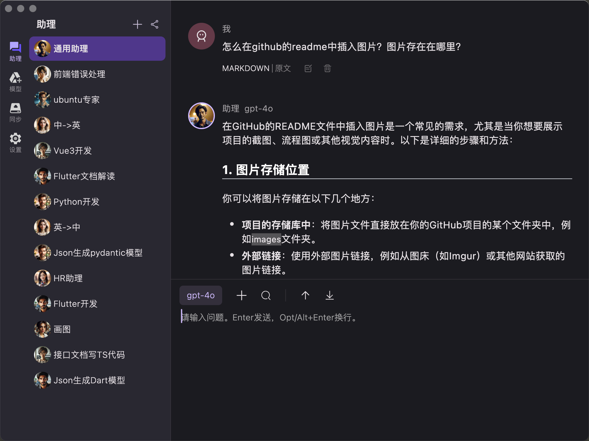
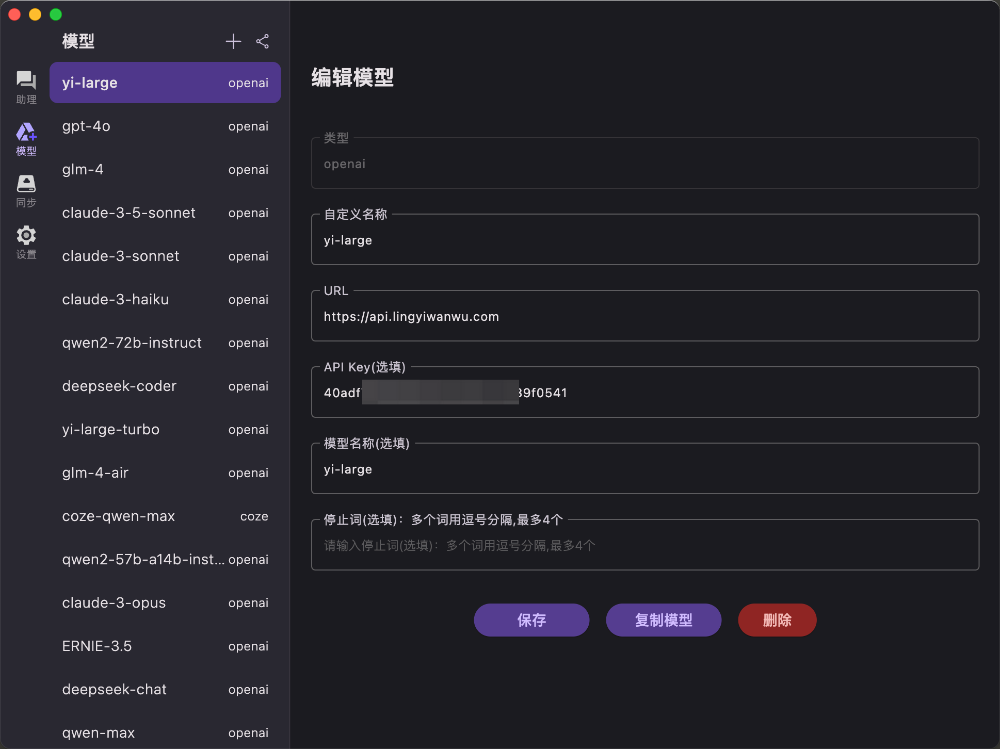

# TalkAI - 接入多种模型，快速切换，高效解决问题。

## 简介

TalkAI 是一款基于 Flutter 开发的大语言模型客户端，支持多种大语言模型服务，提供模型和助理（提示词）管理、数据同步等功能。

很显然，我是一名程序员。在我的工作中，就算是GPT-4也不能完全解答我的所有问题，我需要频繁切换不同的模型，以便高效的解决问题。但我接触到的多个对话工具，并没有满足我这个需求。所以自己动手，开发了这款工具。

## 特性

- **多种协议**：兼容 OpenAI API、阿里云 DashScope、百度云千帆、Coze扣子等多种协议
- **支持平台**：Windows、MacOS
- **数据同步**：利用阿里云盘实现跨设备、跨平台的模型和助理（提示词）同步，数据存储在用户个人网盘空间。
- **隐私保护**：纯客户端应用，无后端服务，不上传用户数据。

## 使用建议

1. 它并不能独立运行，需要配合大语言模型服务使用。
   - 你可以自行注册兼容OpenAI API的服务，例如：零一万物、DeepSeek等。如果你能获得OpenAI API的服务，当然也可以使用。
   - 注册阿里云DashScope，可以使用通义千问；注册百度云千帆，可以使用文心一言。
   - 国内版Coze扣子，提供了豆包、通义千问等模型；海外版Coze扣子，提供了GPT-4、GPT-4o等模型。

2. 你需要学习编写提示词的技巧，以便更好的使用助理功能。

## 快速开始

### 安装指南

1. 进入项目 Releases 页面，选择最新版本。

#### Windows 用户：
- 下载 `TalkAI-x.x.x-windows-setup.exe`
- 双击安装文件进行安装

#### MacOS 用户：
- 下载 `TalkAI-x.x.x-macos.zip`
- 解压后将应用移动到"应用程序"文件夹
- 首次启动可能需要在"系统设置"-"隐私与安全"中允许运行

### 从源码构建

- 安装 Flutter 开发环境（SDK 版本要求：3.x+）
- 克隆本仓库
- 运行或编译项目

### 添加模型

以兼容 OpenAI API 的"零一万物"为例：

1. 访问[零一万物官网](https://platform.lingyiwanwu.com/)注册账号(目前有赠送免费额度)
2. 在"工作台"创建 API Key
3. 在 TalkAI 的"模型"页面，点击左上角"+"，选择"OpenAI API"并点击"添加"
4. 填写参数：
    - 自定义名称：`yi-large`
    - URL：`https://api.lingyiwanwu.com`
    - API Key：刚创建的 API Key
    - 模型名称：`yi-large`
5. 点击"保存"

零一万物，还提供其他型号的模型，请参考官网文档。
OpenAI官方API服务、和其他兼容OpenAI API协议的服务，也可以按照类似的步骤添加。

### 添加助理

创建通用对话助理：

1. 在"助理"页面，点击左上角"+"
2. 助理名称填写：通用助理
3. 点击"添加"
4. 开始对话

如需设置特定任务的预设提示词，可在添加助理时进行配置。

### 其他功能

- **切换模型**：通过输入框上方按钮快速切换，或使用回答结尾的圆环箭头重新生成。
- **会话管理**：使用工具栏"+"开启新会话，避免上下文干扰。上下箭头用于会话导航。
- **分享功能**：左上角分享按钮可将模型和助理设置转为代码分享。
- **数据同步**：需注册阿里云盘并授权 TalkAI 使用。

### 模型资源

- 国内很多AI平台兼容OpenAI API协议，例如：零一万物、DeepSeek，目前都有免费体验额度。
- 阿里云DashScope、百度云千帆，目前提供一个月的免费体验额度。
- Coze扣子国内版，目前API服务免费，可以使用豆包、通义千问等模型；海外版提供GPT-4、GPT-4o模型，但需付费。

## 联系方式

如有任何问题或建议，欢迎联系：

- GitHub: [nickham-su](https://github.com/nickham-su)
- 邮箱: 50793247@qq.com
